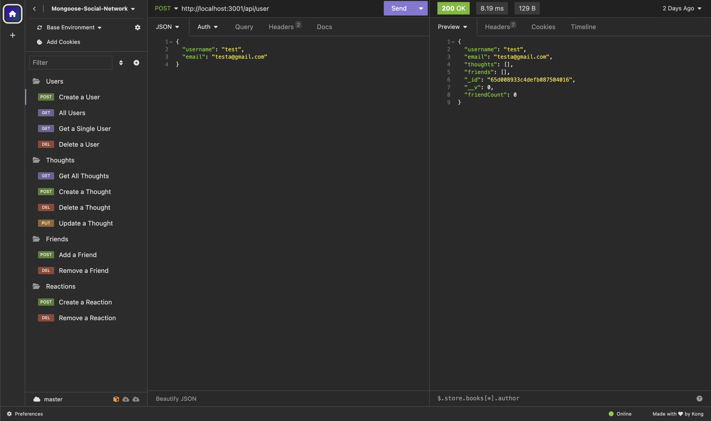
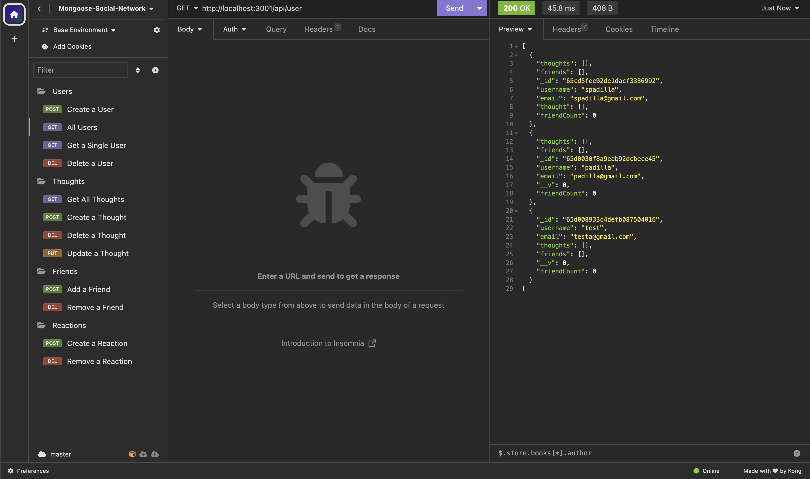
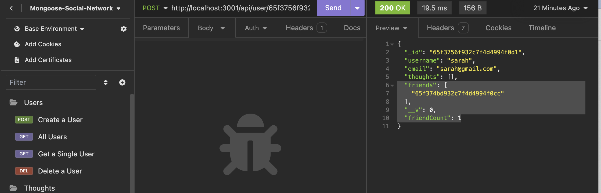
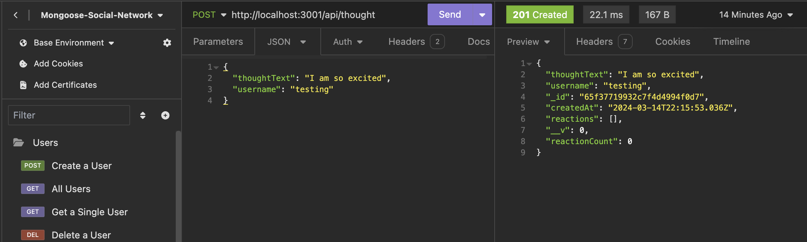
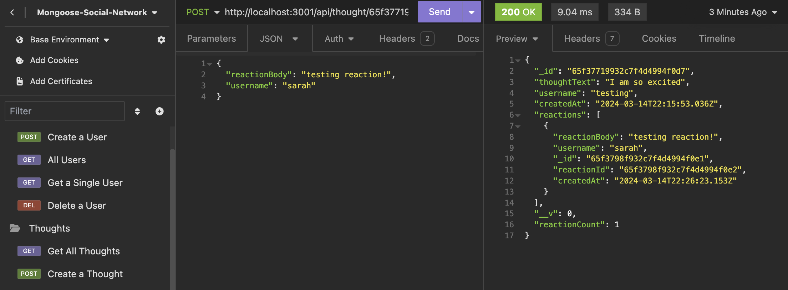

# mongoose-social-network

## Description

This challenge is to build an API for a social network web application where users can share their thoughts, react to friends' thoughts, and create a friends list while using Express.js for routing, a MongoDB database, and the Mongoose ODM

## User Story

```md
AS A social media startup
I WANT an API for my social network that uses a NoSQL database
SO THAT my website can handle large amounts of unstructured data
```

## Acceptance Criteria

```md
GIVEN a social network API 
WHEN I enter the command to invoke the application
THEN my server is started and the Mongoose models are synced to the MongoDB database.
WHEN I open API GET routes in Insomnia for users and thoughts 
THEN the data for each of these routes is displayed in a formatted JSON
WHEN I test API POST, PUT, and DELETE routes in Insomnia
THEN I am able to successfully create, update, and delete users and thoughts in my database.
WHEN I test API POST and DELETE routes in Insomnia 
THEN I am able to successfully create and delete reactions to thoughts and add and remove friends to a user’s friend list
```

## Installation

To install the following, enter in the command line:
 - Node: 'npm init'
 - Express: 'npm i express@4.18.2'
 - Dotenv: 'npm i dotenv'
 - Mongoose: 'npm i mongoose'
 - Modemon: 'npm i nodemon'
 - Jest: 'npm i jest'

 'npm run start' in terminal to start application

## Images

### Create User Preview



 - POST /api/user
 - DELETE /api/user/:userId (to delete a single user)

### All Users Preview



 - GET /api/user

### Get Single User Preview


 - GET /api/user/:userId

### Add Friend Preview



 - POST /api/user/:userId/friends/:friendId
 - DELETE /api/user/:userId/friends/:friendId (to delete a friend)

### Create Thought Preview



 - POST /api/thought
 - GET /api/thought (to get all thoughts)
 - DELETE /api/thought/:thoughtId (to delete a thought)
 - PUT /api/thought/:thoughtId (to update a thought)

### Create Reaction Preview



 - POST /api/thought/:thoughtId/reactions
 - DELETE /api/thought/:thoughtId/reactions/:reactionId (to delete a reaction)

## Link to Video Walkthrough

**Video:** [Link](https://youtu.be/HzJ5uwG0V1k)

## Credits

Stack Overflow
AskBCS for helping to deploy onto Insomnia

## License

